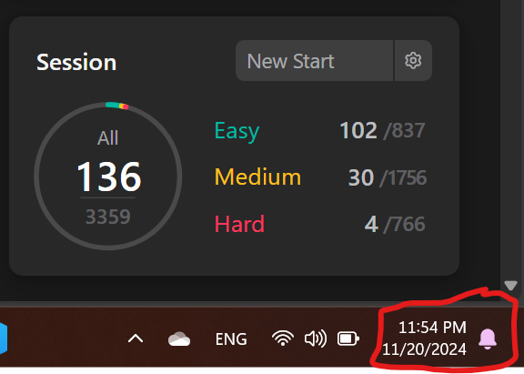

# 500 Leetcode Challenge
## Overview
This is a repo where I'm going to share my journey of solving 500 leetcode problems. 
#### Note: I sloved around 136 problems since the time creating this repo but I will redo them and post every problem I do to this repo. Do not ask me why I focused on the easy problems lol

## Objectives
1) Make my github account looks cool so I can flex on other developers with my commits dashboard (I heard someone got a 500k job offer for having nice commits dashboard, why not me :( )
2) Show people that I really do leetcode. I do leetcode. 
3) You can trust me that I'm a good software engineer

## Progress so far
Problems solved: 44

Brain cells lost: Too many to count 🧠

## Disclaimer
1) All the solutions will be mine, maybe not all the time sometimes I rely on discussions and leetcode editorial but not chatgpt.
2) Do not blame me when your machine blows by using my code I'm not responsible do not waste your money to sue me.
3) This is all for my personal refrence but feel free to learn from my dumb mistakes.

## Quick Notes and Concerns Per Problem:
1930 - solution time is O(N^2) but can be met with O(N)

1249 - have messy code and will fix later

You're welcome 

Happy Leetcoding :)
